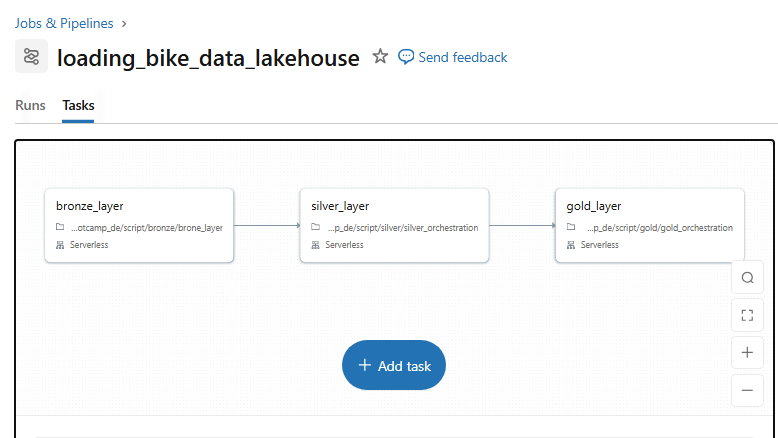

# 🚲 Databricks Bike Data Lakehouse Project

This repository documents the end-to-end implementation of a modern **Data Lakehouse** using the **Medallion Architecture**. The project focuses on transforming raw, fragmented data from CRM and ERP systems into a high-performance **Star Schema** designed for professional Business Intelligence and analytics.

Built on **Databricks** with **Unity Catalog** governance, this implementation demonstrates real-world data engineering best practices—from ingestion through dimensional modeling to automated pipeline orchestration.

---

## 🏗️ Architecture Overview

The project leverages the **Medallion Architecture** to ensure data quality and reliability throughout the pipeline:

### Layer Definitions

**Bronze Layer (Raw Archive)**
* Immutable, 1:1 copy of source data preserving the "raw truth"
* Schema-on-read with automatic inference
* No transformations—only ingestion
* Stored as Delta tables for ACID compliance

**Silver Layer (Cleansed & Standardized)**
* Filtered, cleaned, and validated data
* Technical debt resolution: whitespace trimming, type coercion, null handling
* Business naming conventions applied
* Ready for feature engineering and advanced analytics

**Gold Layer (Business Ready)**
* Highly refined data modeled into Fact and Dimension tables
* Conforms to Star Schema for optimized query performance
* Implements Slowly Changing Dimensions (SCD Type 2) for historical tracking
* Production-grade tables for BI tools and dashboards

---

## 🚀 Implementation Phases

### Phase 1: Initialization
**Notebook:** `init_lakehouse`

The foundation of the project involves setting up the governance and environment:

**Unity Catalog Setup**
* Creation of a three-tier namespace (Catalog → Schema → Table) to manage data assets
* Centralized governance for access control, lineage, and audit logging
* Workspace catalog configuration with appropriate permissions

**Schema Initialization**
* Deployment of `bronze`, `silver`, and `gold` schemas within the workspace catalog
* Separation of concerns across data maturity levels
* Schema-level access policies for data security

**Workspace Configuration**
* Setting up global variables and environment parameters for Spark sessions
* Configuration of Delta Lake optimization settings
* Initialization of compute resources and cluster policies

---

### Phase 2: Bronze Layer (Raw Ingestion)
**Notebook:** `bronze/brone_layer`

This phase focuses on the **"Zero Transformation"** rule to preserve the raw truth of the data.

#### Multi-Source Ingestion Strategy

**CRM System Sources:**
* `crm_cust_info` - Customer demographic and profile information
* `crm_prd_info` - Product catalog with descriptions and categories
* `crm_sales_details` - Transactional sales records with timestamps

**ERP System Sources:**
* `erp_cust_az12` - Customer master data in AZ12 format (legacy system)
* `erp_loc_a101` - Store location and geographical hierarchy (A101 standard)
* `erp_px_cat_g1v2` - Product category taxonomy in G1V2 format

#### Technical Implementation

**File Reading:**
* CSV files sourced from **Unity Catalog Volumes** (cloud-native object storage)
* Schema inference enabled with header detection
* Character encoding handling (UTF-8 standard)

**Delta Lake Conversion:**
* Ingesting files into **Delta tables** to enable:
  * ACID transactions for concurrent reads/writes
  * Schema enforcement and evolution
  * Time travel for data versioning
  * Z-Ordering for query optimization

**Output Location:**
* All Bronze tables written to `workspace.bronze` schema
* Table naming convention: `{source_system}_{entity_name}`

---

### Phase 3: Silver Layer (Cleaning & Standardization)

**Orchestration Notebook:** `silver/silver_orchestration`

The Silver layer is the "Cleansing Room" where technical debt is resolved and data quality is enforced.

#### Orchestration Pattern

The orchestration notebook uses `dbutils.notebook.run()` to sequentially execute transformation notebooks, ensuring proper dependency management and error handling across six parallel workstreams.

---

#### 🔵 CRM Data Processing (`silver/crm/`)

**1. Customer Information Processing**
* **Notebook:** `silver_crm_cust_info`
* **Source:** `workspace.bronze.crm_cust_info`
* **Destination:** `workspace.silver.crm_customers`

**Transformations Applied:**
* **String Sanitization:** Automated trimming of leading/trailing whitespaces using Python loops
* **Code Normalization:** Standardizing cryptic source codes:
  * Marital Status: `S` → `Single`, `M` → `Married`, `D` → `Divorced`
  * Gender: `F` → `Female`, `M` → `Male`
* **Column Renaming:** Business-friendly headers (e.g., `CTEID` → `customer_id`, `GNDR` → `gender`)
* **Data Type Enforcement:** Explicit casting for dates, integers, and decimals

**2. Product Information Processing**
* **Notebook:** `silver_crm_prd_info`
* **Source:** `workspace.bronze.crm_prd_info`
* **Destination:** `workspace.silver.crm_products`

**Transformations Applied:**
* Product description cleaning (removal of special characters, standardization of units)
* Category hierarchy validation
* Price field normalization (currency conversion, decimal precision)
* Null handling for optional attributes

**3. Sales Details Processing**
* **Notebook:** `silver_crm_sales_details`
* **Source:** `workspace.bronze.crm_sales_details`
* **Destination:** `workspace.silver.crm_sales`

**Transformations Applied:**
* Transaction timestamp standardization (UTC conversion)
* Sales amount validation (negative value checks, range validation)
* Foreign key integrity checks (customer_id, product_id existence)
* Duplicate transaction detection and deduplication

---

#### 🟢 ERP Data Processing (`silver/erp/`)

**1. ERP Customer Master (AZ12)**
* **Notebook:** `silver_erp_cust_az12`
* **Source:** `workspace.bronze.erp_cust_az12`
* **Destination:** `workspace.silver.erp_customers`

**Transformations Applied:**
* Legacy format parsing (fixed-width field extraction)
* Customer attribute standardization (alignment with CRM schema)
* Address parsing and geocoding preparation
* Customer status flag normalization

**2. Location Hierarchy (A101)**
* **Notebook:** `silver_erp_loc_a101`
* **Source:** `workspace.bronze.erp_loc_a101`
* **Destination:** `workspace.silver.erp_locations`

**Transformations Applied:**
* Store location data standardization
* Geographical hierarchy validation (Region → District → Store)
* Coordinate validation and normalization
* Store operational status tracking

**3. Product Category Taxonomy (G1V2)**
* **Notebook:** `silver_erp_px_cat_g1v2`
* **Source:** `workspace.bronze.erp_px_cat_g1v2`
* **Destination:** `workspace.silver.erp_product_categories`

**Transformations Applied:**
* Category hierarchy flattening (nested JSON to columnar)
* Taxonomy standardization across L1/L2/L3 levels
* Category code validation against master reference
* Hierarchy path construction for drill-down analytics

---

### Phase 4: Gold Layer (Dimensional Modeling)

**Orchestration Notebook:** `gold/gold_orchestration`

Data is structured for the final **"Product" state** following Star Schema design principles.

#### Orchestration Pattern

The Gold orchestration notebook ensures that dimension tables are created before fact tables, maintaining referential integrity through surrogate key relationships.

---

#### 📊 Dimension Tables

**1. Customer Dimension (SCD Type 2)**
* **Notebook:** `gold_dim_customers`
* **Sources:** `workspace.silver.crm_customers`, `workspace.silver.erp_customers`
* **Destination:** `workspace.gold.dim_customers`

**Modeling Approach:**
* **Unified Customer View:** Merges CRM and ERP customer data using fuzzy matching and master data management rules
* **SCD Type 2 Implementation:**
  * `customer_key` - Surrogate key (auto-incrementing integer)
  * `customer_id` - Natural business key
  * `start_date` - Record effective date
  * `end_date` - Record expiration date (9999-12-31 for current records)
  * `is_current` - Boolean flag for active version
* **Change Detection:** Tracks modifications to customer attributes over time for historical analysis

**2. Product Dimension**
* **Notebook:** `gold_dim_products`
* **Sources:** `workspace.silver.crm_products`, `workspace.silver.erp_product_categories`
* **Destination:** `workspace.gold.dim_products`

**Modeling Approach:**
* Product master with full category hierarchy (L1 → L2 → L3)
* Combines product information with ERP taxonomy
* Includes attributes: SKU, description, category, price, status
* Enables drill-down reporting from category to individual products

---

#### 📈 Fact Tables

**1. Sales Fact Table**
* **Notebook:** `gold_fact_sales`
* **Source:** `workspace.silver.crm_sales`
* **Destination:** `workspace.gold.fact_sales`

**Star Schema Design:**
* **Foreign Keys:** Links to dimension tables via surrogate keys
  * `customer_key` → `dim_customers`
  * `product_key` → `dim_products`
  * `location_key` → `dim_locations` (future implementation)
  * `date_key` → `dim_date` (future implementation)
* **Measures:**
  * `quantity` - Units sold
  * `unit_price` - Price per unit at transaction time
  * `gross_sales` - Quantity × Unit Price
  * `discount_amount` - Applied discounts
  * `net_sales` - Gross Sales - Discounts
* **Grain:** One row per transaction line item
* **Optimizations:** Partitioned by `sale_date`, Z-Ordered by `customer_key`

---

### Phase 5: Pipeline Automation

> **Goal:** Automate the end-to-end Lakehouse flow so data is processed reliably from Bronze to Silver to Gold with minimal human intervention.

**Job Name:** `loading_bike_data_lakehouse`

Automation of the full lifecycle using **Databricks Workflows** (formerly Jobs).

#### Pipeline Architecture

**Task 1: Bronze Ingestion**
* **Task Name:** `bronze_layer`
* **Notebook:** `bronze/brone_layer`
* **Function:** Triggers initial file ingestion from Unity Catalog Volumes
* **Dependencies:** None (entry point)
* **Retry Policy:** 2 retries with 5-minute intervals

**Task 2: Silver Transformation**
* **Task Name:** `silver_layer`
* **Notebook:** `silver/silver_orchestration`
* **Function:** Runs the standardized cleaning orchestration (6 notebooks)
* **Dependencies:** Depends on `bronze_layer` (sequential execution)
* **Timeout:** 30 minutes

**Task 3: Gold Modeling**
* **Task Name:** `gold_layer`
* **Notebook:** `gold/gold_orchestration`
* **Function:** Executes dimensional modeling (3 notebooks)
* **Dependencies:** Depends on `silver_layer`
* **Timeout:** 20 minutes



---

#### ✅ Implementation Checklist

**Step 1: Create Orchestration Notebooks**

- [ ] **Silver Orchestration:** Create `silver/silver_orchestration` notebook
  * Use `dbutils.notebook.run()` to execute in sequence:
    * `./crm/silver_crm_cust_info`
    * `./crm/silver_crm_prd_info`
    * `./crm/silver_crm_sales_details`
    * `./erp/silver_erp_cust_az12`
    * `./erp/silver_erp_loc_a101`
    * `./erp/silver_erp_px_cat_g1v2`
  * Implement error handling and logging
  * Return execution summary with row counts

- [ ] **Gold Orchestration:** Create `gold/gold_orchestration` notebook
  * Use `dbutils.notebook.run()` to execute in sequence:
    * `./gold_dim_customers` (dimension first)
    * `./gold_dim_products` (dimension first)
    * `./gold_fact_sales` (fact last)
  * Validate dimension tables before fact table creation

**Step 2: Create Databricks Job**

- [ ] Navigate to **Databricks → Workflows → Jobs**
- [ ] Click **Create Job**
- [ ] Configure job settings:
  * **Name:** `loading_bike_data_lakehouse`
  * **Cluster:** Serverless compute (auto-scaling)
  * **Email notifications:** Add your email for failure alerts

- [ ] Add Task 1 (Bronze):
  * Task name: `bronze_layer`
  * Type: Notebook
  * Notebook path: `/Users/{username}/databricks_bootcamp_de/script/bronze/brone_layer`
  * Cluster: Shared serverless

- [ ] Add Task 2 (Silver):
  * Task name: `silver_layer`
  * Type: Notebook
  * Notebook path: `/Users/{username}/databricks_bootcamp_de/script/silver/silver_orchestration`
  * **Depends on:** `bronze_layer`

- [ ] Add Task 3 (Gold):
  * Task name: `gold_layer`
  * Type: Notebook
  * Notebook path: `/Users/{username}/databricks_bootcamp_de/script/gold/gold_orchestration`
  * **Depends on:** `silver_layer`

**Step 3: Run and Validate**

- [ ] Click **Run Now** to trigger the job manually
- [ ] Monitor execution in the **Runs** tab:
  * Check task progress (green = success, red = failure)
  * Review logs for each task
  * Inspect data lineage graph

- [ ] Verify table creation and row counts:
  ```sql
  -- Bronze Layer Validation
  SELECT 'crm_cust_info' AS table_name, COUNT(*) AS row_count FROM workspace.bronze.crm_cust_info
  UNION ALL
  SELECT 'crm_prd_info', COUNT(*) FROM workspace.bronze.crm_prd_info
  UNION ALL
  SELECT 'crm_sales_details', COUNT(*) FROM workspace.bronze.crm_sales_details;
  
  -- Silver Layer Validation
  SELECT 'crm_customers' AS table_name, COUNT(*) AS row_count FROM workspace.silver.crm_customers
  UNION ALL
  SELECT 'crm_products', COUNT(*) FROM workspace.silver.crm_products
  UNION ALL
  SELECT 'crm_sales', COUNT(*) FROM workspace.silver.crm_sales;
  
  -- Gold Layer Validation
  SELECT 'dim_customers' AS table_name, COUNT(*) AS row_count FROM workspace.gold.dim_customers
  UNION ALL
  SELECT 'dim_products', COUNT(*) FROM workspace.gold.dim_products
  UNION ALL
  SELECT 'fact_sales', COUNT(*) FROM workspace.gold.fact_sales;
  
  -- Referential Integrity Check
  SELECT 
    COUNT(*) AS total_sales,
    COUNT(DISTINCT customer_key) AS unique_customers,
    COUNT(DISTINCT product_key) AS unique_products
  FROM workspace.gold.fact_sales;
  ```

**Step 4: Schedule the Pipeline**

- [ ] In the Job configuration, click **Add Trigger**
- [ ] Choose **Scheduled** trigger
- [ ] Configure schedule:
  * **Type:** Cron expression
  * **Schedule:** Daily at 2:00 AM UTC
  * **Cron:** `0 0 2 * * ?`
  * **Timezone:** UTC (or your business timezone)
  * **Pause on failure:** Enabled (prevents cascade failures)

- [ ] **First 3 Days - Monitoring Phase:**
  * Review job runs daily
  * Check execution logs for warnings
  * Validate data quality metrics (null rates, duplicate counts)
  * Monitor cluster utilization and costs
  * Verify downstream BI dashboard refreshes

- [ ] **Production Stabilization:**
  * After 3 successful consecutive runs, mark as production-ready
  * Set up **PagerDuty** or **Slack** alerts for job failures
  * Configure retry policies (2-3 retries with exponential backoff)
  * Document runbook for common failure scenarios

---

### 📊 Pipeline Benefits

* ✅ **Automated Execution:** End-to-end processing from Bronze to Gold without manual intervention
* ✅ **Dependency Management:** Task sequencing ensures proper execution order and data availability
* ✅ **Error Handling:** Built-in retry policies and failure notifications minimize data pipeline downtime
* ✅ **Observability:** Job run history, logs, and data lineage provide full visibility into pipeline health
* ✅ **Scheduling:** Regular data refreshes on business cadence (daily, hourly, real-time)
* ✅ **Scalability:** Serverless compute auto-scales based on workload, optimizing cost and performance
* ✅ **Governance:** Unity Catalog tracks data lineage from source to consumption

---

## 📁 Project Structure

```
databricks_bootcamp_de/
├── README.md                           # Project documentation
└── script/
    ├── init_lakehouse                  # Phase 1: Environment setup and governance
    ├── bronze/
    │   └── brone_layer                 # Phase 2: Raw data ingestion (6 sources)
    ├── silver/
    │   ├── silver_orchestration        # Phase 3: Orchestration entry point
    │   ├── crm/
    │   │   ├── silver_crm_cust_info    # CRM customer cleaning
    │   │   ├── silver_crm_prd_info     # CRM product cleaning
    │   │   └── silver_crm_sales_details # CRM sales cleaning
    │   └── erp/
    │       ├── silver_erp_cust_az12    # ERP customer standardization
    │       ├── silver_erp_loc_a101     # ERP location standardization
    │       └── silver_erp_px_cat_g1v2  # ERP category standardization
    └── gold/
        ├── gold_orchestration          # Phase 4: Orchestration entry point
        ├── gold_dim_customers          # Customer dimension (SCD Type 2)
        ├── gold_dim_products           # Product dimension
        └── gold_fact_sales             # Sales fact table (Star Schema)
```

---

## 🗂️ Unity Catalog Structure

```
workspace (catalog)
│
├── bronze (schema) ─────────────── Raw Archive Layer
│   ├── crm_cust_info (table)       ← CRM Customer Source
│   ├── crm_prd_info (table)        ← CRM Product Source
│   ├── crm_sales_details (table)   ← CRM Sales Source
│   ├── erp_cust_az12 (table)       ← ERP Customer (AZ12 Format)
│   ├── erp_loc_a101 (table)        ← ERP Location (A101 Standard)
│   └── erp_px_cat_g1v2 (table)     ← ERP Category (G1V2 Taxonomy)
│
├── silver (schema) ──────────────── Cleansed Layer
│   ├── crm_customers (table)       ← Cleaned CRM Customers
│   ├── crm_products (table)        ← Cleaned CRM Products
│   ├── crm_sales (table)           ← Cleaned CRM Sales
│   ├── erp_customers (table)       ← Standardized ERP Customers
│   ├── erp_locations (table)       ← Standardized ERP Locations
│   └── erp_product_categories (table) ← Standardized ERP Categories
│
└── gold (schema) ────────────────── Business Layer (Star Schema)
    ├── dim_customers (table)       ← Customer Dimension (SCD Type 2)
    ├── dim_products (table)        ← Product Dimension
    └── fact_sales (table)          ← Sales Fact (Grain: Transaction Line)
```

---

## 🛠️ Tech Stack & Key Concepts

### Platform & Frameworks
* **Platform:** Databricks (Serverless Compute on AWS)
* **Compute Engine:** Apache Spark 3.5 (Distributed Processing)
* **Languages:** PySpark, Spark SQL
* **Storage Format:** Delta Lake (Parquet + Transaction Log)
* **Governance:** Unity Catalog (Centralized Metadata & Access Control)

### Key Concepts Demonstrated

**Data Architecture:**
* ✅ **Medallion Architecture** (Bronze → Silver → Gold progressive refinement)
* ✅ **Star Schema Modeling** (Fact and Dimension tables for OLAP workloads)
* ✅ **Slowly Changing Dimensions (SCD Type 2)** for historical tracking
* ✅ **Multi-Source Integration** (CRM and ERP system consolidation)

**Data Engineering:**
* ✅ **Schema Inference** from CSV files with header detection
* ✅ **Data Quality Transformations** (trimming, normalization, validation)
* ✅ **ETL Orchestration Patterns** using `dbutils.notebook.run()`
* ✅ **Incremental Processing** with Delta Lake merge operations

**Databricks Features:**
* ✅ **Unity Catalog** for data governance and lineage tracking
* ✅ **Delta Lake** for ACID transactions and time travel
* ✅ **Workflows (Jobs)** for pipeline automation and scheduling
* ✅ **Serverless Compute** for auto-scaling and cost optimization
* ✅ **Z-Ordering** for query performance optimization

---

## 📚 Learning Outcomes

By completing this project, you will gain hands-on experience with:

1. **Lakehouse Architecture:** Understand the principles of Bronze-Silver-Gold data organization
2. **Data Governance:** Implement Unity Catalog for secure, governed data access
3. **Dimensional Modeling:** Design Star Schemas for analytical workloads
4. **ETL Development:** Build robust data pipelines with error handling and orchestration
5. **Production Operations:** Schedule, monitor, and maintain automated data workflows
6. **Performance Tuning:** Optimize Spark jobs with partitioning, caching, and Z-Ordering

---

## 🛡️ License

This project is licensed under the [MIT License](LICENSE). You are free to use, modify, and share this project with proper attribution.

---

## 📞 Contact & Contributions

For questions, suggestions, or contributions, please open an issue or submit a pull request. Let's build better data platforms together! 🚀
